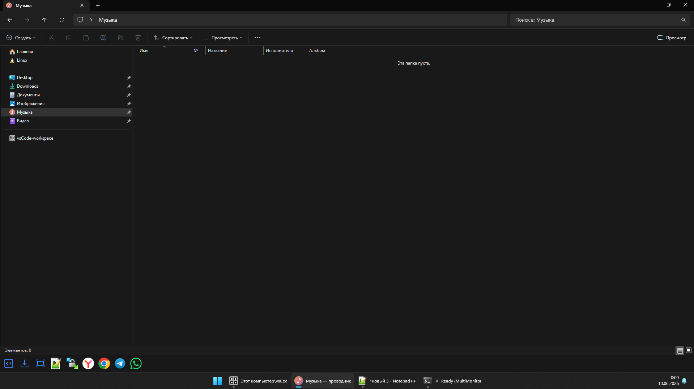

# MultiMonitorPanel - отдельная панель запуска на каждый монитор Windows

[](LICENSE)


**MultiMonitorPanel** - бесплатная portable-панель запуска для Windows 10/11.
Программа создаёт **отдельный док на каждом мониторе**, а у каждого дока может
быть свой набор кнопок: папки на левом экране, IDE на центральном, терминалы,
админские утилиты или удалённые подключения на правом.

Если вы искали **отдельную панель задач на второй монитор**, **multi monitor
dock**, **launcher panel for Windows**, **панель быстрого запуска для нескольких
мониторов** или способ запускать программы сразу на нужном экране - это ровно
та задача, которую решает MultiMonitorPanel.

**Главное за 10 секунд**

- **Скачать:** откройте [Releases / Latest](https://github.com/e-u-shapovalov/MultiMonitorPanel/releases/latest) и в блоке **Assets** скачайте `panel.exe`.
- **Запустить:** дважды щёлкните по `panel.exe`. Панель появится внизу каждого монитора.
- **Настроить:** нажмите правой кнопкой мыши по панели -> **Изменить настройки...**.
- **Не скачивайте исходники:** если вы обычный пользователь, не нажимайте **Code -> Download ZIP** и не качайте **Source code**.

English version: [README.en.md](README.en.md)  
Подробный мануал: [docs/MANUAL.ru.md](docs/MANUAL.ru.md)  
Инструкция для новичка: [DOWNLOAD.md](DOWNLOAD.md)

---

## Что это за программа

Штатная панель задач Windows умеет показываться на нескольких мониторах, но
обычно дублирует одни и те же закреплённые приложения. MultiMonitorPanel делает
иначе: каждому монитору даётся собственная полоса кнопок.

Панель создаётся как настоящая системная **Windows AppBar**. Это важно: Windows
резервирует под неё место, поэтому развёрнутые окна не перекрывают док. При
клике по кнопке программа запускается на том мониторе, где была нажата кнопка.

Приложение написано на чистом **C++/WinAPI**. Это один нативный `.exe` примерно
на 300-400 КБ, без .NET, Electron, Node.js, установщика и тяжёлых фоновых служб.

## Скачать MultiMonitorPanel

### Для обычного пользователя

1. Откройте страницу [последнего релиза](https://github.com/e-u-shapovalov/MultiMonitorPanel/releases/latest).
2. Найдите блок **Assets** внизу описания релиза.
3. Скачайте готовый файл программы:
   - в текущем релизе это **`panel.exe`**;
   - если в будущем появится архив вида `MultiMonitorPanel-...-win64.zip`, скачивайте его из **Assets**.
4. Если скачали `panel.exe`, положите его в удобную папку, например:

   ```text
   C:\Tools\MultiMonitorPanel\panel.exe
   ```

5. Запустите `panel.exe` двойным кликом.

**Важно:** GitHub автоматически показывает файлы **Source code (zip)** и
**Source code (tar.gz)**. Это исходный код для разработчиков. Обычному
пользователю нужен файл из **Assets**, сейчас это `panel.exe`.

Прямая ссылка на последний релиз:
[MultiMonitorPanel — последний релиз](https://github.com/e-u-shapovalov/MultiMonitorPanel/releases/latest)

### Если вы не умеете пользоваться GitHub

GitHub Releases - это раздел, где автор проекта выкладывает готовые версии
программы. На странице репозитория он находится справа или сверху по ссылке
**Releases**. Самый простой путь:

1. Нажмите здесь: [скачать последнюю версию](https://github.com/e-u-shapovalov/MultiMonitorPanel/releases/latest).
2. Прокрутите страницу до слова **Assets**.
3. Нажмите на `panel.exe`.
4. Если браузер предупреждает, что это `.exe`, подтвердите скачивание только если
   адрес начинается с `https://github.com/e-u-shapovalov/MultiMonitorPanel/`.
5. Откройте папку загрузок и перенесите `panel.exe` в постоянную папку.
6. Запустите файл.

Не используйте кнопку **Code** на главной странице репозитория. Она скачивает
исходники, а не готовую программу.

## Установка и первый запуск

MultiMonitorPanel не требует установки.

1. Создайте папку, например `C:\Tools\MultiMonitorPanel`.
2. Положите туда `panel.exe`.
3. Запустите `panel.exe`.
4. При первом запуске программа создаст образцовый набор кнопок и служебные
   файлы рядом с exe:
   - `info.txt` - краткая инструкция;
   - `lang\ru.lang` и `lang\en.lang` - шаблоны языков;
   - `ico\` - папка для пользовательских иконок.
5. Правый клик по любой панели -> **Изменить настройки...**.

Для автозапуска вместе с Windows:

1. Нажмите `Win+R`.
2. Введите `shell:startup`.
3. Положите в открывшуюся папку ярлык на `panel.exe`.

Если Windows SmartScreen показывает предупреждение, проверьте, что файл скачан
из этого репозитория, затем нажмите **Подробнее -> Выполнить в любом случае**.

## Возможности

- **Один док на каждый монитор.** У каждого экрана свой набор кнопок.
- **Настоящий Windows AppBar.** Панель резервирует место на экране, развёрнутые
  окна её не закрывают.
- **Запуск на нужном мониторе.** Новое окно переносится на экран, где была
  нажата кнопка.
- **Группы слева, по центру и справа.** Можно разнести папки, программы и
  системные утилиты по разным краям панели.
- **Разделители.** Тонкие вертикальные линии помогают визуально разбить кнопки.
- **Встроенный редактор настроек.** Без `regedit`, JSON, INI и ручного
  редактирования файлов.
- **Свои иконки.** Поддерживаются `.ico`, `.png`, `.jpg`, `.bmp`, `.gif`, `.tiff`.
- **Запуск от администратора.** Для кнопки можно включить UAC-запуск.
- **Режим консоли.** Для `cmd`, PowerShell и похожих программ можно запускать
  через classic `conhost`, чтобы окно появлялось на нужном мониторе.
- **Русский и английский интерфейс.** Переключение через меню **Язык / Language**.
- **Per-monitor DPI.** Панели корректно пересоздаются при смене DPI, разрешения,
  поворота, подключении и отключении мониторов.
- **Один экземпляр.** Повторный запуск не плодит копии процесса.

## Кому это нужно

MultiMonitorPanel полезен, если вы:

- работаете с двумя или тремя мониторами;
- хотите разные закреплённые кнопки на разных экранах;
- используете отдельный монитор под терминалы, IDE, браузер, таск-трекер,
  проводник, удалённые подключения или админские инструменты;
- не хотите ставить тяжёлые комбайны вроде desktop customization suites ради
  простой панели быстрого запуска;
- ищете лёгкую альтернативу ручному открытию программ и перетаскиванию окон.

## Чем лучше ручного способа

Без MultiMonitorPanel типичный сценарий выглядит так: открыть программу,
перетащить её на нужный монитор, повторить для каждой утилиты, снова поправить
после смены мониторов. MultiMonitorPanel убирает эту рутину: кнопка уже живёт на
том экране, где программа нужна, а окно после запуска переносится туда
автоматически.

В отличие от скинов и тяжёлых панелей, приложение использует системный механизм
AppBar и не требует отдельного рантайма.

## Скриншоты



На скриншоте видно нижнюю панель MultiMonitorPanel с отдельными кнопками запуска:
папки, инструменты, браузер, Telegram, WhatsApp и другие ярлыки остаются рядом с
рабочим экраном, а обычная панель задач Windows продолжает жить отдельно.

Для следующего обновления желательно добавить ещё два изображения: окно
**Изменить настройки...** и меню правого клика. Требования к скриншотам лежат в
[docs/screenshots/README.md](docs/screenshots/README.md).

## Как пользоваться

После запуска внизу каждого монитора появится тёмная полоса с кнопками.

Правый клик по панели открывает меню:

- **Изменить настройки...** - добавить, удалить и изменить кнопки.
- **Перезагрузить настройки** - перечитать конфиг и перерисовать панели.
- **Образцовый набор** - вернуть демонстрационный набор на 3 монитора.
- **Стереть настройки** - убрать все кнопки.
- **Язык / Language** - переключить интерфейс.
- **Открыть папку программы** - открыть папку с `panel.exe`.
- **О программе** - версия, дата релиза, автор и ссылка на GitHub.
- **Выход** - закрыть программу.

Настройки хранятся в реестре:

```text
HKCU\Software\MultiMonitorPanel
```

Редактировать реестр вручную не нужно: используйте встроенное окно настроек.

## Что можно запускать кнопкой

Поле `target` может быть:

- именем программы: `notepad.exe`, `calc.exe`, `cmd.exe`;
- полным путём: `C:\Program Files\App\app.exe`;
- папкой: `C:\Users\Name\Downloads`;
- приложением Microsoft Store через `shell:AppsFolder\<AUMID>`;
- путём с переменными окружения: `%USERPROFILE%\Downloads`.

Аргументы командной строки указываются отдельно в поле `args`.

## Ограничения

- Проект рассчитан на Windows 10/11.
- Linux, macOS и старые версии Windows не поддерживаются.
- SVG-иконки не загружаются напрямую; конвертируйте SVG в PNG.
- Перенос окна на нужный монитор лучше всего работает для обычных Win32-приложений.
  Single-instance приложения, UWP/Store-приложения и лаунчеры иногда открывают
  окно в уже существующем процессе, поэтому Windows может оставить их на старом
  экране.
- Конфигурация хранится в реестре текущего пользователя и не переносится вместе
  с `panel.exe` автоматически.

## FAQ

### Это замена панели задач Windows?

Нет. MultiMonitorPanel не показывает открытые окна и не заменяет системный
таскбар. Это отдельная панель быстрого запуска для нескольких мониторов.

### Нужно ли устанавливать программу?

Нет. Это portable-приложение: скачайте `panel.exe`, положите в папку и запустите.

### Что скачивать: Source code или panel.exe?

Обычному пользователю нужен `panel.exe` из блока **Assets** на странице Releases.
**Source code** нужен только разработчикам.

### Почему не надо нажимать Code -> Download ZIP?

Эта кнопка скачивает исходный код репозитория. Внутри может быть проект, ресурсы
и скрипты сборки, но это не лучший путь для запуска программы. Готовые версии
лежат в **Releases**.

### Как добавить свою кнопку?

Правый клик по панели -> **Изменить настройки...** -> **Добавить**. Заполните
подпись, путь запуска, аргументы при необходимости и выберите край панели.

### Как сделать разные кнопки на разных мониторах?

В редакторе выберите монитор сверху. `monitor_1` - самый левый экран,
`monitor_2` - следующий справа и так далее.

### Как полностью сбросить настройки?

Правый клик по панели -> **Образцовый набор** для возврата к примеру или
**Стереть настройки**, если нужны пустые панели.

### Где лежат настройки?

В реестре Windows:

```text
HKCU\Software\MultiMonitorPanel
```

### Можно ли запускать вместе с Windows?

Да. Создайте ярлык на `panel.exe`, откройте `Win+R` -> `shell:startup` и
положите ярлык в эту папку.

## Troubleshooting

### Панель не появилась

- Проверьте, что запущен `panel.exe`.
- Посмотрите в Диспетчере задач, нет ли уже работающего `panel.exe`.
- Попробуйте закрыть процесс и запустить снова.
- Если настройки были стёрты, панель может быть пустой: правый клик по полосе ->
  **Образцовый набор**.

### Windows предупреждает о неизвестном приложении

Это обычное поведение SmartScreen для новых open-source `.exe` без коммерческой
подписи. Проверьте адрес скачивания и используйте **Подробнее -> Выполнить в
любом случае**.

### Консоль открывается не на том мониторе

В настройках кнопки включите флаг **Консоль (conhost)**. Это особенно важно для
`cmd.exe`, PowerShell и других консольных команд.

### Приложение всё равно открывается на старом экране

Так бывает у программ, которые используют уже запущенный процесс или собственный
лаунчер. MultiMonitorPanel переносит окна процесса, который удалось запустить и
найти; некоторые приложения перехватывают запуск сами.

### Иконка не отображается

- Убедитесь, что файл иконки лежит в папке `ico` рядом с `panel.exe` или указан
  полным путём.
- Используйте `.ico`, `.png`, `.jpg`, `.bmp`, `.gif` или `.tiff`.
- SVG нужно заранее конвертировать в PNG.

### Хочу удалить программу

Закройте MultiMonitorPanel через правый клик -> **Выход**, удалите папку с
`panel.exe`. При необходимости удалите ветку настроек:

```text
HKCU\Software\MultiMonitorPanel
```

## Для разработчиков

Требования:

- Windows 10/11;
- Visual Studio 2022 Build Tools;
- workload **Desktop development with C++**;
- Windows SDK.

Сборка:

```bat
git clone https://github.com/e-u-shapovalov/MultiMonitorPanel.git
cd MultiMonitorPanel
build.bat
```

`build.bat` вызывает `vcvars64.bat`, компилирует `res\panel.rc` и
`src\panel.cpp`, линкует нативный `build\panel.exe`, закрывает уже запущенную
копию `panel.exe` и запускает свежую сборку.

Структура проекта:

```text
MultiMonitorPanel/
├── src/panel.cpp          основной код приложения
├── res/panel.rc           ресурсы Windows
├── res/app.manifest       DPI awareness, Common Controls v6, совместимость
├── res/app.ico            иконка приложения
├── build.bat              сборка через MSVC
├── build/panel.exe        локальная собранная версия
├── build/ico/             пример папки пользовательских иконок
├── docs/                  подробные русские и английские мануалы
├── DOWNLOAD.md            простая инструкция скачивания
├── RELEASE.md             текст и чек-лист для релиза
└── LICENSE                MIT
```

## SEO: как это может называться

MultiMonitorPanel закрывает сценарии, которые пользователи часто ищут как:
**отдельная панель задач на второй монитор**, **панель запуска для двух
мониторов**, **разные закреплённые приложения на разных мониторах Windows**,
**multi monitor dock**, **per-monitor launcher**, **Windows AppBar launcher**,
**portable launcher for Windows 10/11**, **quick launch panel for multiple
monitors**, **separate taskbar alternative for second monitor**.

Это не замена системного таскбара и не менеджер окон, а лёгкая нативная панель
быстрого запуска, которая помогает разложить рабочие инструменты по экранам.

## Лицензия и автор

Лицензия: [MIT](LICENSE)  
Автор: Evgenii Shapovalov / Евгений Шаповалов  
Репозиторий: <https://github.com/e-u-shapovalov/MultiMonitorPanel>

Обратная связь, ошибки и предложения: создавайте issue на GitHub или используйте
раздел Discussions, если он включён в репозитории.
